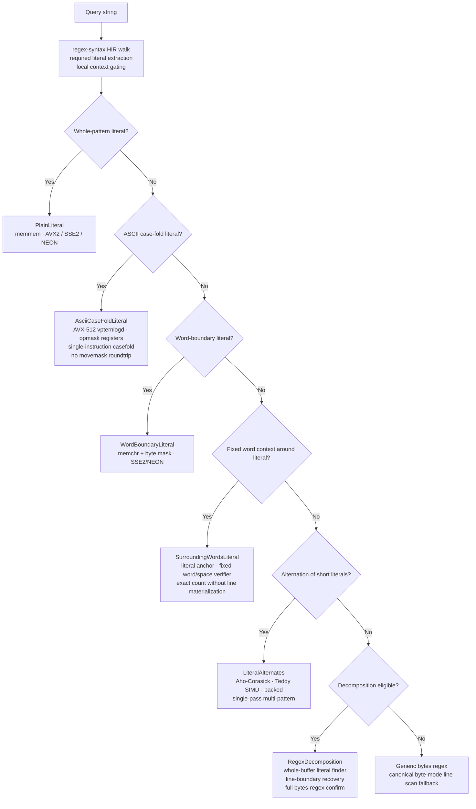
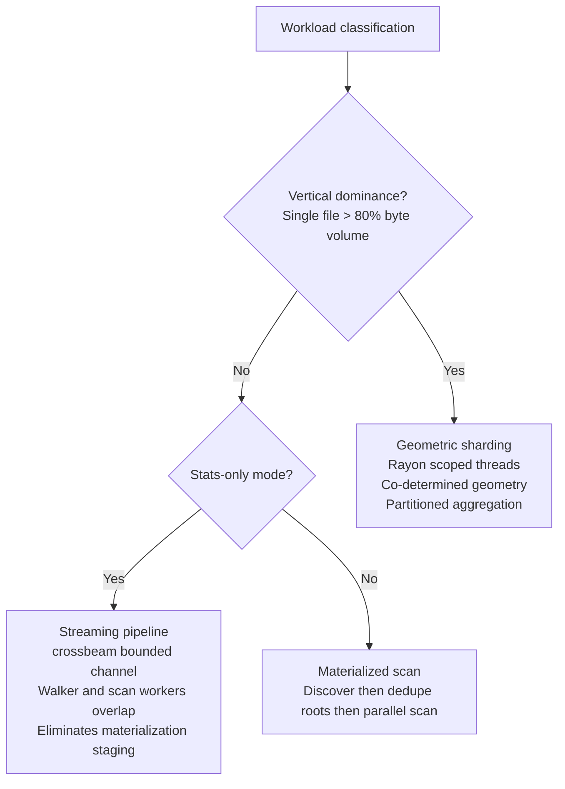
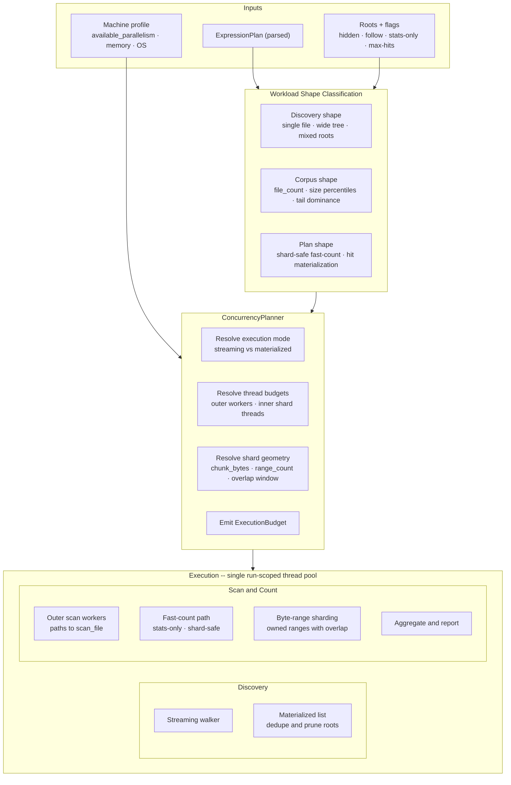
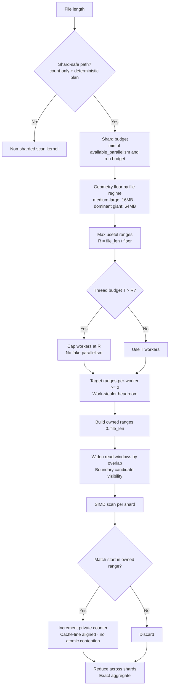
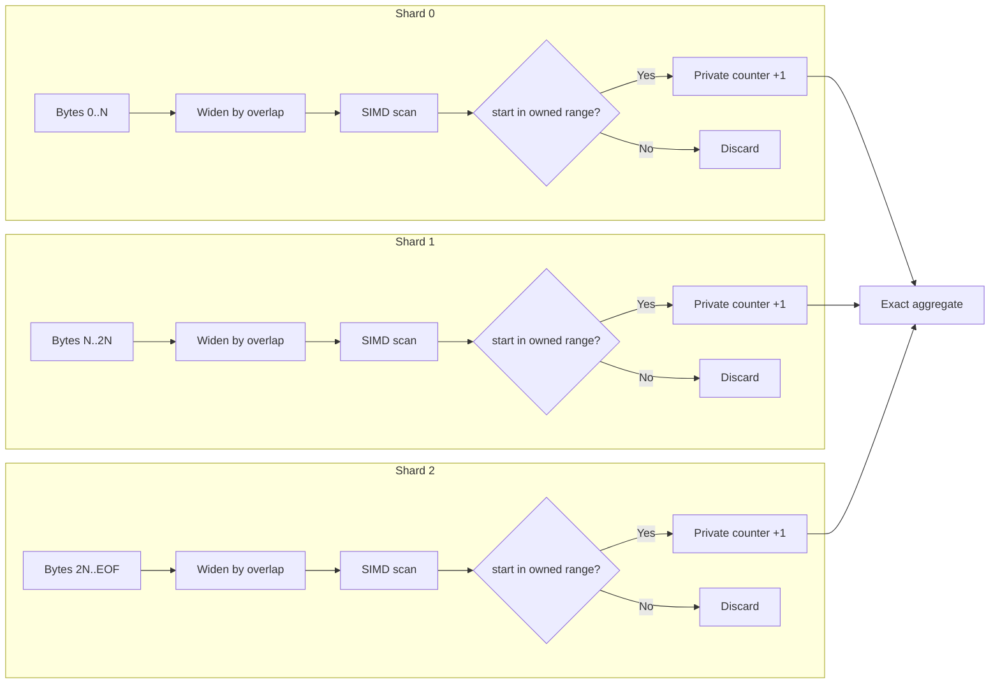
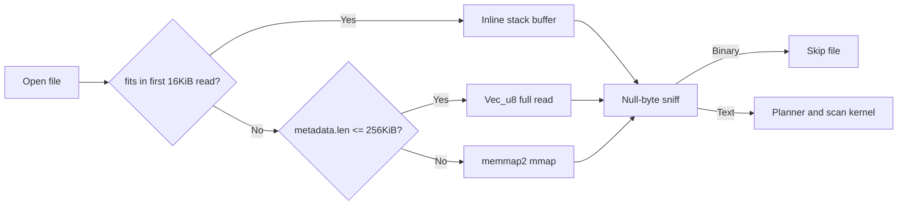

<div align="center">

# IX

**A Rust search engine that compiles each query into the fastest exact machine for its pattern structure.**

*Regex HIR classification · SIMD-accelerated scan kernels · Aho-Corasick Teddy multi-pattern · AVX-512 casefold · core-scaled parallelism · typed expressions with boolean composition*

---

[](https://github.com/savageops/iEx/actions/workflows/build-native-binaries.yml)
[](https://github.com/savageops/iEx/releases/latest)
[](https://iex.run)
[](https://www.rust-lang.org/)
[](./LICENSE)

[Site](https://iex.run) · [Releases](https://github.com/savageops/iEx/releases/latest) · [Docs](https://iex.run/docs)

</div>

---

IX analyzes pattern structure before scanning a single byte. A regex that is structurally a literal routes to `memmem` with SIMD acceleration. A case-insensitive ASCII literal routes to an AVX-512 kernel that folds case comparison into a single CPU instruction. An alternation of short literals routes to Aho-Corasick with the Teddy SIMD backend, matching all patterns simultaneously in one pass. The general regex engine is a fallback, not the default path.

Parallelism scales to every available core. When a single file dominates the corpus, the engine shards inward — partitioning the file into byte ranges processed by dedicated workers with cache-line-aligned private counters and overlap windows for boundary correctness. Search results include structured telemetry in a single typed sentinel that agents and automation can parse without scraping.

---

## Quick start

```sh
cargo install iex-cli

# rg-compatible flags — same engine underneath
ix timeout .
ix -F -i "session timeout" .
ix -e timeout -e error .

# Native IX expressions with boolean composition
ix search "lit:error && re:\btimeout\b" . --json
ix search "re:TODO|FIXME" crates
ix search "lit:TODO || lit:FIXME" crates

# Count-only mode — maximum throughput, no hit payload
ix search "re:CVE-\d{4}-\d{4,6}" . --stats-only --json
ix search "re:\w{5}\s+Holmes\s+\w{5}" . --stats-only --json

# Inspect files with bounded windows and continuation hints
ix inspect crates/iex-cli/src/main.rs --range 40:80
ix inspect --expr "lit:SearchConfig" crates --context 2 --json

# See which machine a pattern compiles to before running
ix explain "lit:breach && lit:auth"
```

**Binaries (no Rust required):** [github.com/savageops/iEx/releases](https://github.com/savageops/iEx/releases)

---

## Pattern lowering

Regex planning is a lowering step, not a second engine. `regex-syntax` HIR analysis classifies each pattern into the narrowest exact machine that preserves correctness. Use `ix explain` to inspect the compiled plan before running a search.


```mermaid
flowchart TD
    Q[Query string] --> AST[regex-syntax HIR walk\nrequired literal extraction\nlocal context gating]
    AST --> C1{Whole-pattern literal?}
    C1 -->|Yes| P1[PlainLiteral\nmemmem · AVX2 / SSE2 / NEON]
    C1 -->|No| C2{ASCII case-fold literal?}
    C2 -->|Yes| P2[AsciiCaseFoldLiteral\nAVX-512 vpternlogd · opmask registers\nsingle-instruction casefold\nno movemask roundtrip]
    C2 -->|No| C3{Word-boundary literal?}
    C3 -->|Yes| P3[WordBoundaryLiteral\nmemchr + byte mask · SSE2/NEON]
    C3 -->|No| C3B{Fixed word context around literal?}
    C3B -->|Yes| P3B[SurroundingWordsLiteral\nliteral anchor · fixed word/space verifier\nexact count without line materialization]
    C3B -->|No| C4{Alternation of short literals?}
    C4 -->|Yes| P4[LiteralAlternates\nAho-Corasick · Teddy SIMD · packed\nsingle-pass multi-pattern]
    C4 -->|No| C5{Decomposition eligible?}
    C5 -->|Yes| P5[RegexDecomposition\nwhole-buffer literal finder\nline-boundary recovery\nfull bytes-regex confirm]
    C5 -->|No| P6[Generic bytes regex\ncanonical byte-mode line scan fallback]
```

| Machine | Implementation | Activates when |
|:--------|:---------------|:---------------|
| `PlainLiteral` | `memmem` over raw bytes | Whole-pattern literal |
| `AsciiCaseFoldLiteral` | AVX-512 `vpternlogd` with opmask registers | ASCII literal with `(?i)` semantics |
| `WordBoundaryLiteral` | `memchr` plus boundary checks | Literal-equivalent `\b...\b` |
| `SurroundingWordsLiteral` | Literal-anchored byte verifier | `\w{N}\s+literal\s+\w{M}` patterns |
| `LiteralAlternates` | Aho-Corasick Teddy SIMD backend | Short literal alternation families (<64 patterns) |
| `FixedWidthBytesRegex` | `regex::bytes` fast-count path | Narrow non-ASCII `(?i)` with stable byte width |
| `RegexDecomposition` | Whole-buffer literal discovery + sparse `regex::bytes` confirm | Stats-only regex with one strong required literal |
| Generic bytes regex | `regex::bytes` line scan | Fallback for patterns that resist narrowing |

The `AsciiCaseFoldLiteral` path evaluates `(byte OR 0x20) == (pattern OR 0x20)` in a single `vpternlogd` instruction cycle. Opmask registers (`k0`–`k7`) produce per-byte results directly, removing the `movemask` extraction roundtrip that AVX2 case-fold approaches require.

The Teddy SIMD backend, ported from Intel Hyperscan, activates via `.packed(Some(true))` on `AhoCorasickBuilder`. It matches all literal alternates simultaneously in a single pass over the input.

---

## Expression language

A typed predicate grammar with native boolean composition. The expression plan is compiled once at parse time and does not change during execution.

| Predicate | Semantics | Example |
|:----------|:----------|:--------|
| `lit:` | Substring containment | `lit:error` |
| `prefix:` | Line-anchored prefix match | `prefix:WARN` |
| `suffix:` | Line-anchored suffix match | `suffix:.json` |
| `re:` | Regex — lowered to the narrowest fast path before fallback | `re:\btimeout\b` |

- `A && B` — conjunction: all predicates must hold on the same line
- `A || B` — disjunction: any predicate holds
- `re:` follows Rust `regex` syntax. No look-around or backreferences.

Bare text in `ix search` is a literal substring: `ix search "a|b" .` searches for the three bytes `a|b`. Use `re:a|b` for regex alternation or `lit:a || lit:b` for literal alternation.

---

## Commands

### `ix search`

The primary search command. Emits hit records followed by one JSON sentinel with status, counts, timings, and concurrency state:

```text
path:line:column:preview
-- ix.result.v1 {"cmd":"search","status":"ok","expr":"lit:SearchConfig","matches":N,"files":{"discovered":N,"scanned":N,"skipped":N},"bytes":N,"ms":{"discover":N,"scan":N,"total":N}} --
```

Zero-match is `status:"ok"` with `matches:0`, not an error. The `expr` field shows what actually ran — useful when comparing `ix search "a|b"` (literal) with `ix "a|b"` (regex via compatibility lowering).

`--json` returns the full structured `SearchReport`. `--stats-only` suppresses hit records for maximum count throughput.

### `ix matches`

Hit records only, no sentinel. For pipe consumers that need raw `path:line:column:preview` rows.

### `ix inspect`

Bounded file windows with continuation hints for scriptable code navigation:

| Workflow | Command |
|:---------|:--------|
| Default bounded read | `ix inspect file` |
| Line range | `ix inspect file --range 40:80` |
| Skip then take | `ix inspect file --skip 120 --limit 30` |
| Match context | `ix inspect --expr "lit:SearchConfig" crates --context 2` |
| JSON excerpts | `ix inspect --expr "re:TODO\|FIXME" crates --context 1 --json` |

Files emit `ix.next.v1` continuation hints so agents can paginate without empty beyond-EOF probes. [Schema details](docs/developer-inspection-command-surface.md)

### `ix explain`

Shows which execution machine a pattern compiles to before running. This is the admission boundary for the planner — see what machine IX will use before committing bytes.

### rg compatibility

The top-level `ix PATTERN [PATH]...` form accepts rg-shaped flags (`-F`, `-i`, `-e`, `-j`, `--json`, `--hidden`) and lowers them into IX expressions. Same engine, same results.

| Input | Lowers to |
|:------|:----------|
| `ix "a\|b" .` | `ix search "re:a\|b" .` |
| `ix -F "a\|b" .` | `ix search "lit:a\|b" .` |
| `ix -i "timeout" .` | `ix search "re:(?i)timeout" .` |
| `ix -e timeout -e error .` | `ix search "re:timeout \|\| re:error" .` |

Unsupported inputs return guided errors instead of silent misinterpretation. The same contract is encoded in `ix --help` and each subcommand's `--help`.

---

## Architecture

<details>
<summary><strong>Execution mode selection</strong></summary>

IX routes each workload through one of three execution modes based on live corpus telemetry. Mode selection is automatic.


```mermaid
flowchart TD
    A[Workload classification] --> B{Vertical dominance?\nSingle file > 80% byte volume}
    B -->|No| C{Stats-only mode?}
    C -->|Yes| D[Streaming pipeline\ncrossbeam bounded channel\nWalker and scan workers overlap\nEliminates materialization staging]
    C -->|No| E[Materialized scan\nDiscover then dedupe roots then parallel scan]
    B -->|Yes| F[Geometric sharding\nRayon scoped threads\nCo-determined geometry\nPartitioned aggregation]
```

Streaming pipelines apply backpressure through `crossbeam`'s bounded channel to prevent memory accumulation on wide trees. Discovery and scan overlap in wall-clock time, eliminating the full path-list materialization tax.

</details>

<details>
<summary><strong>Concurrency planner</strong></summary>

The planner ingests the parsed `ExpressionPlan`, corpus shape signals, and machine profile from `std::thread::available_parallelism()`, then emits an `ExecutionBudget` governing thread allocation, execution mode, and shard geometry. No worker starts before those decisions are committed.


```mermaid
flowchart TB
  subgraph Inputs["Inputs"]
    I1["ExpressionPlan (parsed)"]
    I2["Roots + flags\nhidden · follow · stats-only · max-hits"]
    I3["Machine profile\navailable_parallelism · memory · OS"]
  end
  subgraph Shape["Workload Shape Classification"]
    S1["Discovery shape\nsingle file · wide tree · mixed roots"]
    S2["Corpus shape\nfile_count · size percentiles · tail dominance"]
    S3["Plan shape\nshard-safe fast-count · hit materialization"]
  end
  subgraph Planner["ConcurrencyPlanner"]
    P1["Resolve execution mode\nstreaming vs materialized"]
    P2["Resolve thread budgets\nouter workers · inner shard threads"]
    P3["Resolve shard geometry\nchunk_bytes · range_count · overlap window"]
    P4["Emit ExecutionBudget"]
  end
  subgraph Exec["Execution -- single run-scoped thread pool"]
    subgraph Discovery["Discovery"]
      D1["Streaming walker"]
      D2["Materialized list\ndedupe and prune roots"]
    end
    subgraph Scan["Scan and Count"]
      O1["Outer scan workers\npaths to scan_file"]
      F1["Fast-count path\nstats-only · shard-safe"]
      B1["Byte-range sharding\nowned ranges with overlap"]
      A1["Aggregate and report"]
    end
  end
  I1 --> Shape
  I2 --> Shape
  I3 --> Planner
  Shape --> Planner
  Planner --> Exec
```

Thread budget and shard geometry are co-determined to prevent nested oversubscription across the single run-scoped pool.

</details>

<details>
<summary><strong>Shard geometry</strong></summary>

File-level parallelism is insufficient when a single file dominates corpus byte volume. IX shards inward: the file is partitioned into disjoint byte ranges, each processed by a dedicated Rayon worker.

Geometry is solved before any worker starts. Thread budget, chunk sizing, and range count are co-determined to keep workers fed without generating scheduler overhead. Minimum chunk floors (16 MB medium-large, 64 MB dominant giant) prevent fake parallelism on underfeedable shard counts.


```mermaid
flowchart TD
    A[File length] --> B{Shard-safe path?\ncount-only + deterministic plan}
    B -->|No| Z[Non-sharded scan kernel]
    B -->|Yes| C[Shard budget\nmin of available_parallelism and run budget]
    C --> D[Geometry floor by file regime\nmedium-large: 16MB · dominant giant: 64MB]
    D --> E[Max useful ranges\nR = file_len / floor]
    E --> F{Thread budget T > R?}
    F -->|Yes| G[Cap workers at R\nNo fake parallelism]
    F -->|No| H[Use T workers]
    G --> I[Target ranges-per-worker >= 2\nWork-stealer headroom]
    H --> I
    I --> J[Build owned ranges 0..file_len]
    J --> K[Widen read windows by overlap\nBoundary candidate visibility]
    K --> L[SIMD scan per shard]
    L --> M{Match start in owned range?}
    M -->|Yes| N[Increment private counter\nCache-line aligned · no atomic contention]
    M -->|No| O[Discard]
    N --> P[Reduce across shards\nExact aggregate]
    O --> P
```


```mermaid
flowchart LR
    subgraph S0["Shard 0"]
        A0[Bytes 0..N] --> W0[Widen by overlap]
        W0 --> X0[SIMD scan]
        X0 --> O0{start in owned range?}
        O0 -->|Yes| C0[Private counter +1]
        O0 -->|No| D0[Discard]
    end
    subgraph S1["Shard 1"]
        A1[Bytes N..2N] --> W1[Widen by overlap]
        W1 --> X1[SIMD scan]
        X1 --> O1{start in owned range?}
        O1 -->|Yes| C1[Private counter +1]
        O1 -->|No| D1[Discard]
    end
    subgraph S2["Shard 2"]
        A2[Bytes 2N..EOF] --> W2[Widen by overlap]
        W2 --> X2[SIMD scan]
        X2 --> O2{start in owned range?}
        O2 -->|Yes| C2[Private counter +1]
        O2 -->|No| D2[Discard]
    end
    C0 --> Total[Exact aggregate]
    C1 --> Total
    C2 --> Total
```

Workers read widened overlap windows to catch matches spanning range boundaries. Each match is credited exclusively to the shard whose owned range contains the match's true start byte. Per-shard counters are cache-line aligned to prevent false sharing and reduce once at completion.

Throughput comes from geometry. Exactness comes from ownership.

</details>

<details>
<summary><strong>Regex decomposition byte sharding</strong></summary>

`RegexDecomposition` uses byte sharding as a bounded literal-discovery accelerator. The planner proves a required literal anchor, then shards only the full-buffer anchor walk. Each shard reads a right-extended window so boundary-crossing anchors remain visible without transferring ownership to the neighboring shard.

After shard-local discovery, candidate line starts are merged globally with `sort_unstable` plus `dedup`. Full `regex::bytes` confirmation runs once per unique candidate line, preserving serial match-count semantics while avoiding duplicate confirmations when multiple anchors land on one line or a candidate line crosses a shard seam.

| Phase | Invariant |
|:------|:----------|
| Anchor discovery | Parallel `memmem`-style traversal over owned byte intervals |
| Boundary handling | Right-extended scan windows expose seam-spanning anchors |
| Candidate ownership | Starts credited only to the shard-owned byte range |
| Context filtering | Guards read the full buffer — lookaround context is exact |
| Regex confirmation | Unique candidate lines confirmed once with `regex::bytes` |

</details>

<details>
<summary><strong>Byte ingress tiers</strong></summary>

Before the planner activates, ingress selects a file-loading strategy. Tiny files stay inline, small files are fully read, larger files are memory-mapped. Binary payloads are rejected on a null-byte sniff before scanning.


```mermaid
flowchart LR
    A[Open file] --> B{fits in first 16KiB read?}
    B -->|Yes| C[Inline stack buffer]
    B -->|No| D{metadata.len <= 256KiB?}
    D -->|Yes| E[Vec_u8 full read]
    D -->|No| F[memmap2 mmap]
    C --> G[Null-byte sniff]
    E --> G
    F --> G
    G -->|Binary| H[Skip file]
    G -->|Text| I[Planner and scan kernel]
```

| Tier | Bound | Strategy |
|:-----|:------|:---------|
| Tiny | `< 16 KiB` | Stack buffer inline read — no heap allocation |
| Small | `<= 256 KiB` | `Vec<u8>` full read — cheap full-file ownership |
| Large | `> 256 KiB` | `memmap2` mapping — zero-copy byte slice for the scan kernel |

</details>

<details>
<summary><strong>Build profiles</strong></summary>

| Profile | Setting | Effect |
|:--------|:--------|:-------|
| `release-lto` | `lto = "fat"` | Whole-program optimization across crate boundaries |
| `release-lto` | `codegen-units = 1` | Larger inlining surface, slower build, faster binary |

</details>

---

## Install

**Binaries:** [github.com/savageops/iEx/releases](https://github.com/savageops/iEx/releases)

| Platform | Binary |
|:---------|:-------|
| Windows | `ix.exe` |
| Linux / macOS | `ix` |

**From source:**

```sh
cargo build --release -p iex-cli
# target/release/ix
```

The binary is named `ix` to keep shell usage short and avoid PowerShell's built-in `iex` alias. The Cargo package remains `iex-cli`.

---

## Repository

| Path | Concern |
|:-----|:--------|
| `crates/iex-core` | Planner, scan kernel, shard geometry, telemetry |
| `crates/iex-cli` | CLI surface (`search`, `matches`, `inspect`, `explain`) and sentinel rendering |
| `docs/` | Public documentation |

**Read next:**
- `crates/iex-core/src/engine.rs` — scan engine, concurrency planner, shard geometry
- `crates/iex-core/src/expr.rs` — expression lowering, fast-path machine classification

---

## License

[MIT](./LICENSE)
